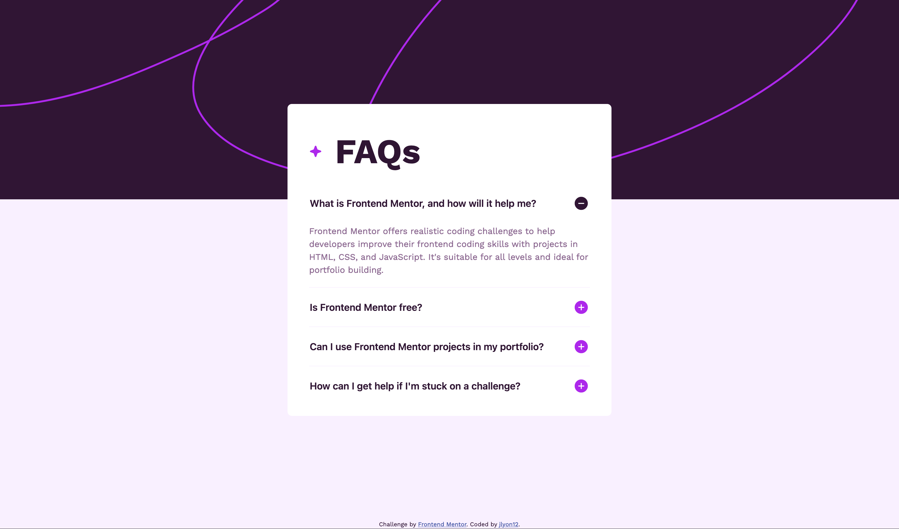

# Frontend Mentor - FAQ accordion solution

This is a solution to the [FAQ accordion challenge on Frontend Mentor](https://www.frontendmentor.io/challenges/faq-accordion-wyfFdeBwBz). Frontend Mentor challenges help you improve your coding skills by building realistic projects.

## Overview

### The challenge

Users should be able to:

- Hide/Show the answer to a question when the question is clicked
- Navigate the questions and hide/show answers using keyboard navigation alone
- View the optimal layout for the interface depending on their device's screen size
- See hover and focus states for all interactive elements on the page

### Screenshot

### Links

- Solution URL: [Frontend Mentor Solution](https://www.frontendmentor.io/solutions/faq-accordion-FE5lUmg66O)
- Live Site URL: [Live](https://jlyon12.github.io/faq-accordion)

## My process

### Built with

- Semantic HTML5 markup
- CSS3
- Javscript

## Author

- Frontend Mentor - [@jlyon12](https://www.frontendmentor.io/profile/jlyon12)
